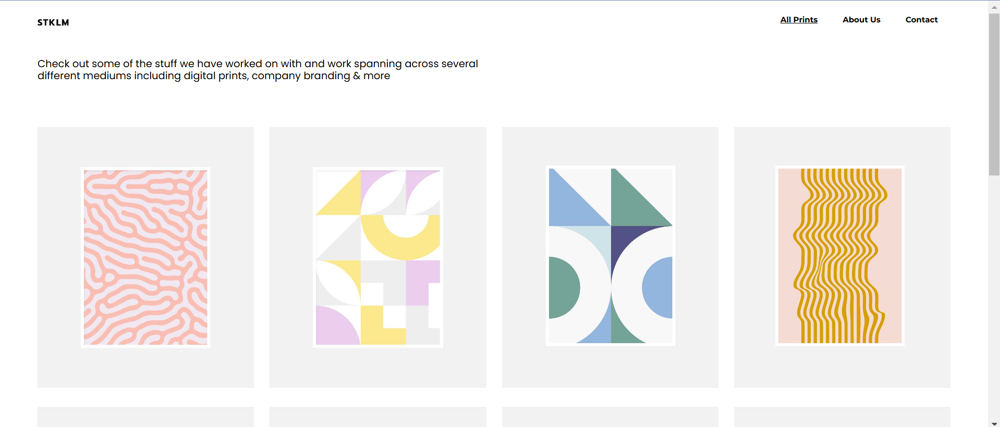

# STKML - Ejercicio SUITCSS

## 🚀 Características

- **Masonería de imágenes**: Presenta una cuadrícula de imágenes.

## 🌐 Tecnologías utilizadas

- **HTML5**: Para la estructura del contenido.
- **CSS3**: Para el estilo y diseño.
- **Font Awesome**: Para iconos modernos y elegantes.

## 📧 Contacto
Si tienes preguntas o comentarios, no dudes en contactarme:

Email: judithfullstack@gmail.com
